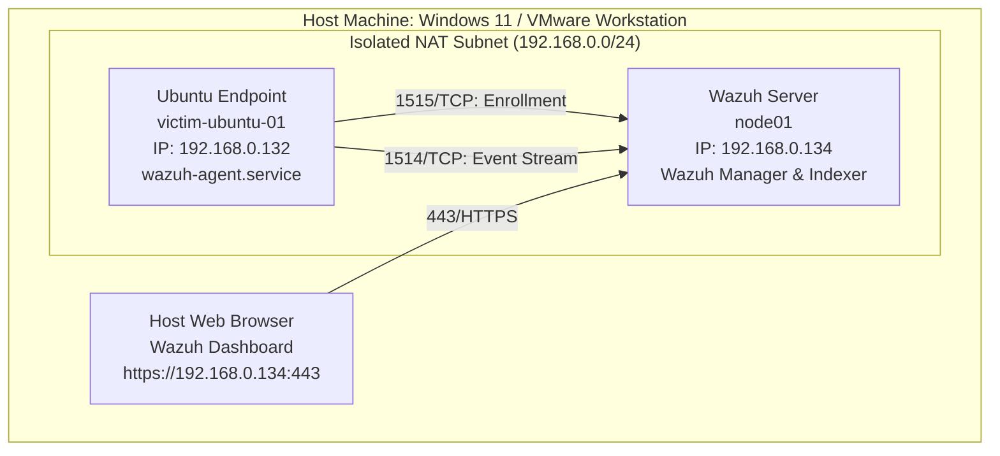
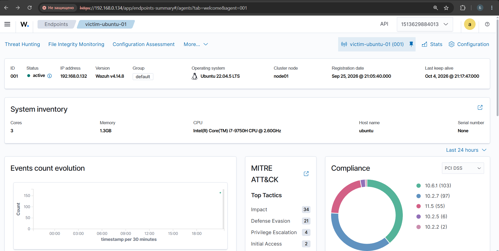
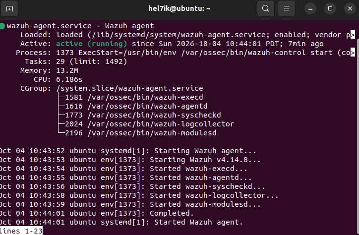
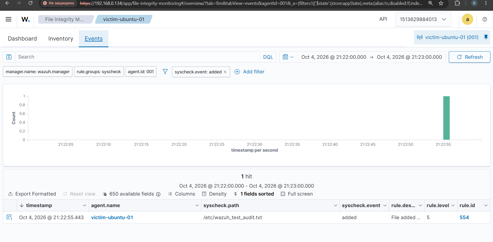

# Wazuh SIEM / FIM Lab

Testing Wazuh v4.14.8 host monitoring, agent enrollment, and File Integrity Monitoring (FIM) in a local virtual environment.

## Lab Setup & Architecture

- **Host / Hypervisor:** Windows 11, VMware Workstation
- **Wazuh Manager:** Ubuntu Server 22.04 LTS (`node01`, `192.168.0.134`)
- **Monitored Endpoint:** Ubuntu 22.04 LTS (`victim-ubuntu-01`, `192.168.0.132`)
- **Network:** Isolated NAT subnet (`192.168.0.0/24`)



---

## 1. Agent Setup and Telemetry

The Wazuh agent was deployed on `victim-ubuntu-01` and pointed to the manager IP. Once enrolled, the manager started pulling system inventory, network interfaces, and basic metrics mapped to MITRE ATT&CK tactics.



The agent runs as a systemd service (`wazuh-agent.service`):

```bash
systemctl status wazuh-agent
```



Processes running on the endpoint:
- `wazuh-agentd`: handles communication with the manager
- `wazuh-syscheckd`: file integrity monitoring engine
- `wazuh-logcollector`: event and log collection
- `wazuh-modulesd`: compliance and security checks

---

## 2. File Integrity Monitoring (FIM) Test

Wazuh `syscheck` is configured on the agent to monitor critical directories (such as `/etc`) for file changes.

To verify detection in real time, a test file was created on the agent:

```bash
sudo touch /etc/wazuh_test_audit.txt
```

### Detection

The manager picked up the event during the syscheck scan:



- **Rule ID:** `554` (Level 5 — File added to the system)
- **Path:** `/etc/wazuh_test_audit.txt`
- **Action:** `added`

This confirms that modifications to watched system paths generate immediate alerts on the manager side.

---

## 3. Network Connectivity & Ports

| Port | Protocol | Purpose | Direction |
|---|---|---|---|
| `1515` | TCP | Agent enrollment service (`wazuh-authd`) | Agent → Manager |
| `1514` | TCP | Secure event data stream | Agent → Manager |
| `443`  | HTTPS | Wazuh Dashboard web UI access | Browser → Manager |
| `55000`| TCP | Wazuh RESTful API communication | Internal / Dashboard |
